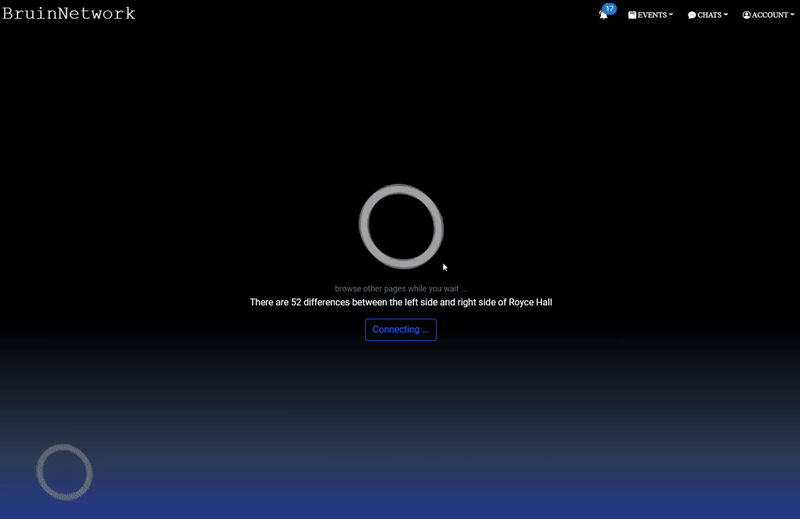

# BruinNetwork
Full stack social network site for students in JavaScript  
Tech Stack: MongoDB, Express, React, Node.js (MERN), socket.io, Google Cloud APIs, Mongoose, Material UI, AWS

## - Random Chat / Chatrooms -
- Join a queue to chat with random online users, the algorithm will automatically connect users
<!--  -->

  

- Searh and enter chatrooms, and see who's online

  

## - Events -
- Search, filter and save events, and see the detailed page as well as get the direction using Google Maps.

  

- Create events for others to join, and organize them in calendar view or list view.

  

## - Profiles & Friends -

- Connect with other users by using friend requests.

  

- Customizable Profile, allowing users to change avatar, bio, contacts, etc.

  

  MIT License - Copyright © 2022 Ken Fukuyama 

